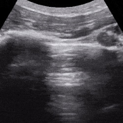

# Automatic detection of COVID-19 from POCUS ultrasound images

### Here, we gather ultrasound data (POCUS) from human lungs, especially from COVID 19 patients. Detecting COVID-19 from POCUS is challenging and time-consuming, even for trained medical doctors. Since the time of doctors is scarce, there is an urgent need to simplify, fasten & automatize the detection of COVID-19, especially non-invasively.  

## Please contribute your own images here or tell us directly where to find them. 


## Learn more about the project
[](https://www.youtube.com/watch?v=UY34-d_yHwo& "POCUS 4 COVID19")


## Here is the current performance of our model (POCUS-splitted data):
*Disclaimer: The model is in a very preliminary stage and was not trained in a scientifically rigorous way.*

Recall = Sensitivity 

Precision = Specificity

```

[INFO] evaluating network...
              precision    recall  f1-score   support

       covid       0.98      0.84      0.90        55
   pneunomia       0.90      0.82      0.86        11
     regular       0.57      0.93      0.70        14

    accuracy                           0.85        80
   macro avg       0.81      0.86      0.82        80
weighted avg       0.90      0.85      0.86        80

[[46  1  8]
 [ 0  9  2]
 [ 1  0 13]]
acc: 0.6875
sensitivity: 0.9787
specificity: 1.0000

```


### COVID
.gif_frame40.jpg)  
### Pneunomia

### Sane



## Installation

The library itself has few dependencies (see [setup.py](setup.py)) with loose requirements. 

To run the code, just install the package `covid_detector` in editable mode for development:

```sh
pip install -e .
```

To run the model just to:

```sh
python3 covid_detector/train_covid19.py --dataset data_pocus-splitted
```


## Results on other data modalities

#### XRay-Data (data as in this repository)
```

[INFO] evaluating network...
              precision    recall  f1-score   support

       covid       1.00      0.80      0.89         5
      normal       0.83      1.00      0.91         5

    accuracy                           0.90        10
   macro avg       0.92      0.90      0.90        10
weighted avg       0.92      0.90      0.90        10


```


#### XRay-Data ([data from Kaggle challenge](https://www.kaggle.com/paultimothymooney/chest-xray-pneumonia/kernels))
This was a sanity check of the model. It was trained only to differentiate *sane* from *pneunomia* since for this more data was available.
```
[INFO] evaluating network...
              precision    recall  f1-score   support

      NORMAL       0.91      0.53      0.67       234
   PNEUMONIA       0.78      0.97      0.86       390

    accuracy                           0.81       624
   macro avg       0.84      0.75      0.77       624
weighted avg       0.83      0.81      0.79       624

[[125 109]
 [ 12 378]]
acc: 0.8061
sensitivity: 0.5342
specificity: 0.9692
```
